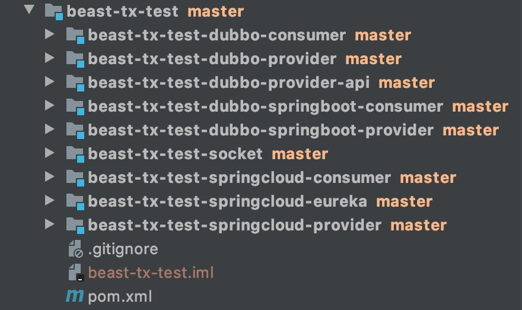

# 1. 介绍

Beast-tx是一个轻量级不侵入业务代码的TCC分布式事务框架。支持dubbo和spring cloud。

有以下特性：

1.支持主流的RPC框架：dubbo和spring cloud

2.配置简单。不侵入业务代码

3.提供一个事务信息收集器，可以自行扩展。

4.几乎没有性能损耗。


?> 项目提供beast-tx_test整个测试用例，文档中以下所有的代码示例，都可以在这个测试用例中找到，供参考




# 2. Beast-tx For Dubbo

## 2.1 如果你使用spring

在你的项目中加上依赖，maven的GAV为：

```xml
<dependency>
  <groupId>com.thebeastshop</groupId>
  <artifactId>beast-tx-dubbo</artifactId>
  <version>${version}</version>
</dependency>
```

!> 目前中央仓库没有上传，需要自己编译打包


然后在dubbo的消费者端的`applicationContext.xml`里配置如下：

```xml
<aop:aspectj-autoproxy proxy-target-class="true"/>
<bean class="com.thebeastshop.tx.aop.TxAspect"/>
<bean class="com.thebeastshop.tx.dubbo.spring.DubboMethodScanner"/>
```


## 2.2 如果你使用springboot

在你的项目中加上依赖，maven的GAV为：

```xml
 <dependency>
   <groupId>com.thebeastshop</groupId>
   <artifactId>beast-tx-dubbo-spring-boot-starter</artifactId>
   <version>${version}</version>
</dependency>
```

!> 目前中央仓库没有上传，需要自己编译打包


> 由于对springboot作了自动装配，因此只需引入包即可。不用额外配置


## 2.3 使用方法

假设你的dubbo提供者端有一个service：DemoService，接口定义如下：

```java
String test1(String name);

String test2(String name, Integer age);

String test3(Long id);
```

假设test方法需要支持分布式TCC事务，则需要遵循以下约定：

- 定义并实现`tryTest(String name)`方法，主要用于校验一些前置条件，如参数合法性，业务的前置判断等。参数必须和主体方法参数一致，<font color='red'>但这不是必须的，如果您的前置判断写在test方法主体里，那这个方法可以不定义</font>。
- 定义并实现`cancelTest(String str)`方法，用于做业务的回滚操作。<font color='red'>如果在回滚方法里需要用到方法主体返回的结果，也可以定义为`cancelTest(String str, Object result)`。BeastTx对这2种定义都支持</font>。


然后在你的dubbo消费者端需要加入分布式事务的service中的method上加上`@@BeastTx`标签即可


完整例子如下：

dubbo提供者端

```java
public interface DemoService {

	boolean tryTest1(String name);
	
  String test1(String name);

  String test2(String name, Integer age);

  String test3(Long id);
	
	void cancelTest1(String str);
	
	void cancelTest2(String str);
}
```

dubbo消费者端

```java
@Service("testService")
public class TestServiceImpl implements TestService {

    private final static Logger log = LoggerFactory.getLogger(TestServiceImpl.class);

    @Resource
    private DemoService demoService;//这是另外一个服务的service

    @Resource
    private JdbcTemplate jdbcTemplate;

    @Override
    @BeastTx
    public void consumerTest() {
        jdbcTemplate.execute("insert into user (name, age) values ('beast-tx', '99131')");

        String result = demoService.test1("jack");
        log.info("result:" + result);
        demoService.test3(8L);
    }
}
```

以上示例为一个`本地事务`+`dubbo远程事务test1`+`dubbo远程事务test3`，假设`dubboService.test3`出错。那整个执行顺序如下：

1. 先执行本地事务`jdbcTemplate.execute("insert into user (name, age) values ('beast-tx', '99131')")`
2. 自动执行`demoService.tryTest1(String name)`进行业务前置判断检查
3. 执行`demoService.test1(String name)`进行业务操作
4. 执行`demoService.test3(Long id)`进行业务操作，抛出错误
5. 自动执行`demoService.cancelTest3(Long id)`进行回滚操作
6. 本地事务的回滚操作


# 3.Beast-tx For Spring Cloud

## 3.1 依赖和配置

在你的项目中加上依赖，maven的GAV为：

```xml
<dependency>
  <groupId>com.thebeastshop</groupId>
  <artifactId>beast-tx-feign-spring-boot-starter</artifactId>
  <version>${version}</version>
</dependency>
```

!> 目前中央仓库没有上传，需要自己编译打包


> springboot会自动装配，如无其他配置


## 3.2 使用方法

对Spring Cloud的Feign提供支持。所需要用的方法约束，和`2.3`类似，不再重复

下面只贴出例子：

Feign的提供者端：

```java
@RestController
public class ProviderController {

    private final Logger log = LoggerFactory.getLogger(this.getClass());

    @Autowired
    private DiscoveryClient discoveryClient;

    @Autowired
    private ProviderDomain providerDomain;

    @RequestMapping("/hi")
    public String sayHello(@RequestParam String name){
        System.out.println("invoke method hi,name="+name);
        String services = "Services:" + discoveryClient.getServices();
        System.out.println(services);
        return "hello," + name;
    }

    @RequestMapping("/tryTest1")
    public boolean tryTest1(@RequestParam String name){
        log.info("invoked tryTest1");
        return providerDomain.tryTest1(name);
    }

    @RequestMapping("/test1")
    public String test1(@RequestParam String name){
        log.info("invoked test1");
        return providerDomain.test1(name);
    }

    @RequestMapping("/cancelTest1")
    public void cancelTest1(@RequestParam String name){
        log.info("invoked cancelTest1");
        providerDomain.cancelTest1(name);
    }

    public String test2(@RequestParam String name){
        return providerDomain.test2(name);
    }
}
```


Feign的消费者端

Feign接口定义：

```java
@FeignClient("test-provider")
public interface TxTestSayhiFeignClient {
    @RequestMapping(value = "hi",method = RequestMethod.GET)
    public String sayHello(@RequestParam(value = "name") String name);

    @RequestMapping(value = "tryTest1",method = RequestMethod.GET)
    public boolean tryTest1(@RequestParam(value = "name") String name);

    @RequestMapping(value = "test1",method = RequestMethod.GET)
    public String test1(@RequestParam(value = "name") String name);

    @RequestMapping(value = "cancelTest1",method = RequestMethod.GET)
    public void cancelTest1(@RequestParam(value ="name") String name);

    @RequestMapping(value = "test2",method = RequestMethod.GET)
    public String test2(@RequestParam(value = "name") String name);
}
```


消费者实现类：

```java
@Component
public class ConsumerDomain {

    @Autowired
    private JdbcTemplate jdbcTemplate;

    @Autowired
    private TxTestSayhiFeignClient txTestSayhiFeignClient;

    @BeastTx
    public String doTest(String name){
        jdbcTemplate.execute("insert into user (name, age) values ('beast-tx', '99131')");

        String result = txTestSayhiFeignClient.test1("jack");
        System.out.println("result:" + result);
        txTestSayhiFeignClient.test2("rose");
        return "ok";
    }
}
```


以上示例为一个`本地事务`+`Feign远程事务test1`+`Feign远程事务test2`，假设`txTestSayhiFeignClient.test2`出错。那整个执行顺序如下：

1. 先执行本地事务`jdbcTemplate.execute("insert into user (name, age) values ('beast-tx', '99131')")`
2. 自动执行`txTestSayhiFeignClient.tryTest1(String name)`进行业务前置判断检查
3. 执行`txTestSayhiFeignClient.test1(String name)`进行业务操作
4. 执行`txTestSayhiFeignClient.test2(String name)`进行业务操作，抛出错误
5. 自动执行`txTestSayhiFeignClient.cancelTest2(String name)`进行回滚操作
6. 本地事务的回滚操作


# 4.回滚之后的Hook接口

当分布式事务回滚之后，Beast-Tx提供了一个可供扩展的hook接口。

只要你的项目中实现了`CancelInvokeHook`这个接口并注册到spring容器中。在项目启动的时候就会被自动扫描到。

当你的分布式事务回滚之后，会自动执行这个hook实现。你可以用来持久化错误信息，打印回滚链路，或者进行一些其他的业务操作。


# 5.监控的扩展

Beast-Tx留了一系列的监控扩展点。

## 5.1 监控的server端（半成品）

其中监控的server端为`beast-tx-monitor`，如启动的话，这个项目目前只接受每一条的事务上下文并打印，并没有对事务上下文作进一步的监控业务，如有兴趣可以自行实现

## 5.2 client端

如果您在dubbo/Spring Cloud消费者端的`application.yml`配了如下配置

```yml
tx:
  monitor:
    ip: 127.0.0.1
    port: 6789
```

springboot启动时会自动装配，在每一个分布式事务结束后，会把这个事务中的详细内容发送到server端。


其中项目对socket提供了2个实现：

`beast-tx-socket-netty`

`beast-tx-socket-tio`

都是用SPI实现的，默认用netty，想换实现，只需换一个依赖包即可


# 6.联系作者


